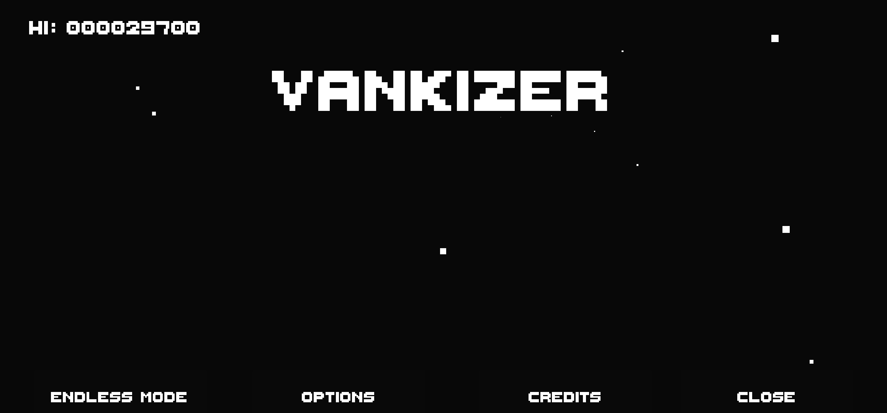
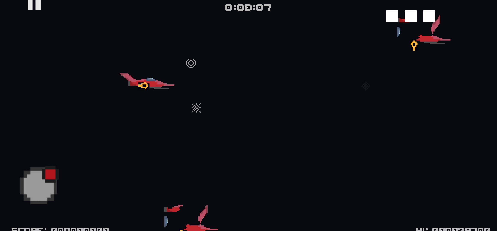

<h1>Vankizer</h1>

My first video game uploaded to Google Play, where I learned to synchronize Unity ads. I developed the entire project myself, even daring to create the music and sound effects

Project made for learning purposes.

If you wanna test it you can play it.
<h2>Controls</h2>
Move: half left of the screen generate a joystick 
Shoot: half right of the screen shoots 

<h2>Objective</h2>
Survive all time that you can

<h2>Image</h2>

